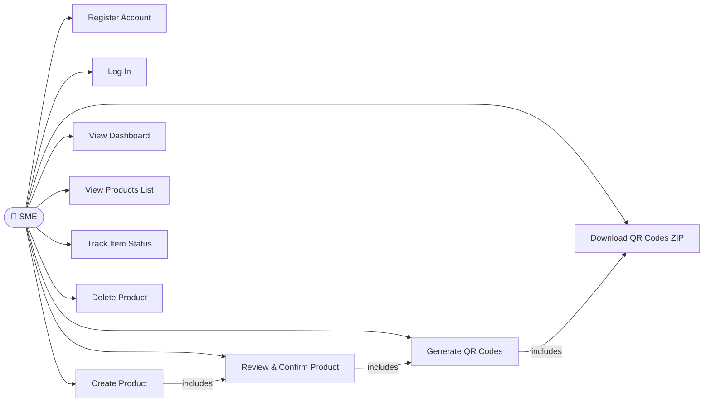
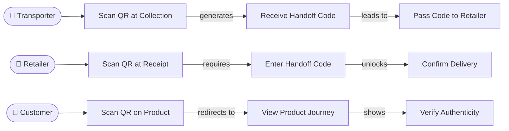
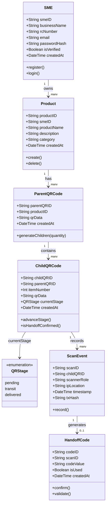
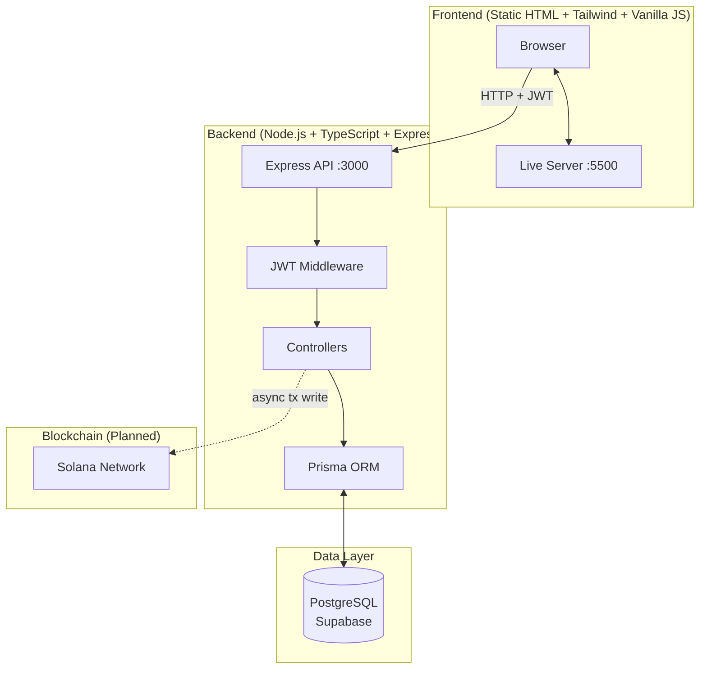
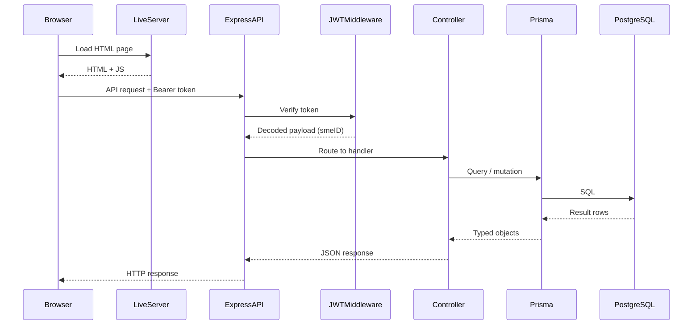
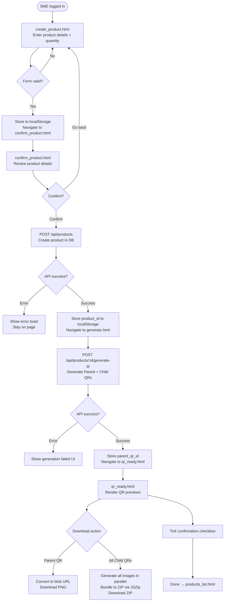
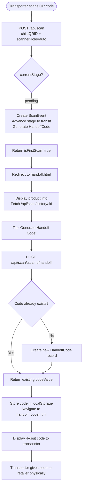
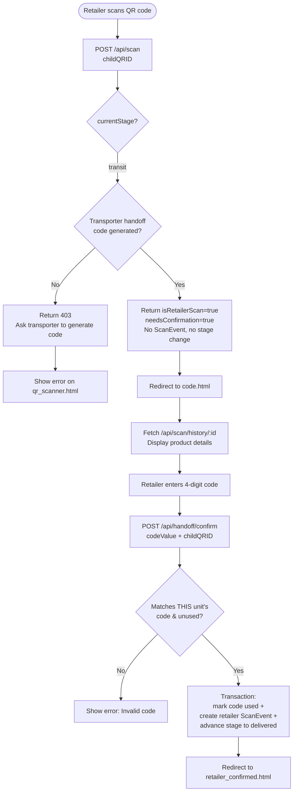
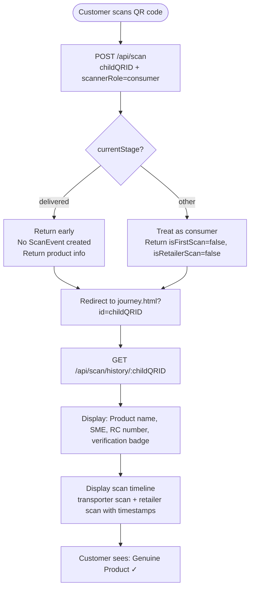
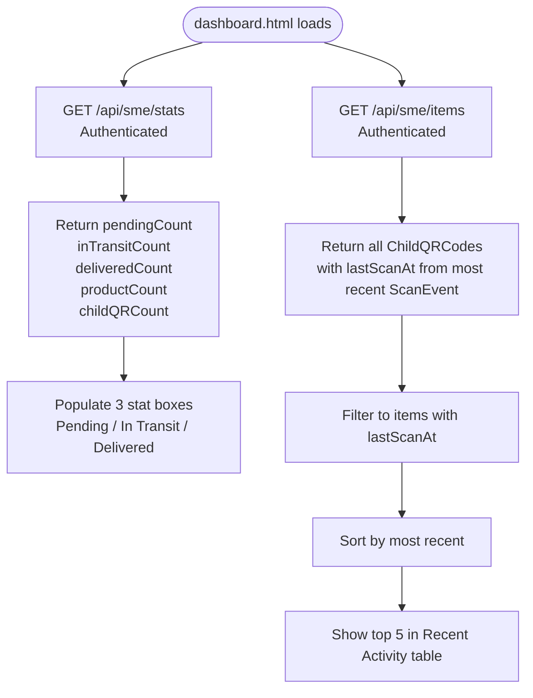

# AuditQR — Software Engineering Design Document

> This document covers the full software engineering lifecycle of the AuditQR project:
> methodology, requirements, object-oriented analysis and design, system architecture,
> process flows, design decisions, and testing. Diagrams are written in Mermaid syntax
> and can be rendered in any Mermaid-compatible tool (e.g. Excalidraw, mermaid.live,
> GitHub, Notion).

---

## Contents

1. [Project Overview](#1-project-overview)
2. [Methodology: Agile + OOADM](#2-methodology-agile--ooadm)
3. [Requirements](#3-requirements)
4. [Use Case Diagrams](#4-use-case-diagrams)
5. [Object-Oriented Analysis](#5-object-oriented-analysis)
6. [Class Diagram](#6-class-diagram)
7. [Database Design (ER Diagram)](#7-database-design-er-diagram)
8. [System Architecture](#8-system-architecture)
9. [Process Flow Diagrams](#9-process-flow-diagrams)
10. [API Design](#10-api-design)
11. [Design Decisions](#11-design-decisions)
12. [Testing](#12-testing)

---

## 1. Project Overview

**AuditQR** is a product authentication and supply chain verification system built for
Nigerian Small and Medium Enterprises (SMEs). The core problem it solves is counterfeit
goods — a widespread issue where fake products enter the supply chain and consumers have
no way to verify what they are buying.

### What It Does

- An SME (manufacturer) registers their business and creates a product on the platform.
- The system generates a **Parent QR code** (representing the batch/carton) and N
  **Child QR codes** (one per individual unit).
- The SME prints and attaches these to their products before dispatch.
- Each unit is tracked through three supply chain stages: **Pending → In Transit → Delivered**.
- A **transporter** scans to record dispatch. A **retailer** scans to confirm receipt.
  A **customer** scans to verify authenticity.
- Every handoff is recorded and, ultimately, anchored to the **Solana blockchain** for
  tamper-proof custody proof.

### Who It Is For

| Actor       | Role                                                          |
| ----------- | ------------------------------------------------------------- |
| SME         | Registers products, generates QR codes, monitors supply chain |
| Transporter | Scans at collection point, confirms item is in their custody  |
| Retailer    | Scans at receipt, enters handoff code to confirm delivery     |
| Customer    | Scans to verify the product is genuine and see its journey    |

---

## 2. Methodology: Agile + OOADM

### Agile

The project was developed using an **Agile iterative approach**. Rather than specifying
all requirements upfront and building to a fixed plan, the system was built in short
iterations — each delivering a working vertical slice of functionality — with design
decisions refined based on what was learned from building the previous iteration.

#### Sprint Breakdown

| Sprint | Focus                                   | Deliverables                                                                        |
| ------ | --------------------------------------- | ----------------------------------------------------------------------------------- |
| 1      | Core domain model + backend scaffolding | Prisma schema, Express server, SME auth (register/login), product CRUD              |
| 2      | QR generation flow                      | `POST /api/products/:id/generate-qr`, child QR generation, `qr_ready.html`          |
| 3      | Scan flow + stage logic                 | `POST /api/scan`, stage enum, `qr_scanner.html`, `journey.html`                     |
| 4      | Handoff gate                            | `HandoffCode` model, transporter → retailer coordination, `handoff.html`            |
| 5      | SME dashboard redesign                  | Item status view (Pending/In Transit/Delivered), `/api/sme/stats`, `/api/sme/items` |
| 6      | Enum rename + DB migration              | `unscanned→pending`, `with_transporter→transit`, collapsed to 3 clean values        |
| 7      | UI polish + QR download improvements    | JSZip bulk download, blob URL fix, spacing fixes, confirm page cleanup              |

#### Agile Practices Applied

- **Iterative delivery**: Each sprint produced working, testable software.
- **Emergent design**: The stage-based scan logic replaced the earlier scan-count
  approach after a retrospective identified that scan count was fragile and could be
  corrupted by test scans. The design was changed mid-project.
- **Continuous refactoring**: The enum was renamed from four ambiguous values to three
  clear ones (`pending/transit/delivered`) when the ambiguity was discovered. The DB was
  migrated live.
- **Scope control**: Participant accounts (giving transporters and retailers their own
  logins) were deliberately deferred to v2 after a design discussion determined the
  scope cost was too high for v1. The handoff code mechanism delivers most of the trust
  benefit at a fraction of the scope.
- **Working software over documentation**: Code was always in a runnable state. The README
  and DESIGN documents were written alongside code, not as a separate documentation phase.

---

### OOADM (Object-Oriented Analysis and Design Methodology)

OOADM was applied across three phases:

#### Phase 1: Object-Oriented Analysis (OOA)

Domain objects were identified from the problem statement and use cases:

- **SME** — the registered business entity
- **Product** — a product line created by an SME
- **ParentQRCode** — a batch/carton-level QR code
- **ChildQRCode** — a unit-level QR code with its own supply chain stage
- **ScanEvent** — a record of a scan at any stage
- **HandoffCode** — a short code generated at the transporter scan, required by the retailer

Relationships were identified:

- An SME _owns_ many Products
- A Product _has_ one or more ParentQRCodes (batches)
- A ParentQRCode _contains_ many ChildQRCodes (units)
- A ChildQRCode _accumulates_ ScanEvents over its lifecycle
- A ScanEvent (transporter) _generates_ one HandoffCode

#### Phase 2: Object-Oriented Design (OOD)

Objects were refined into:

- **Entities** → Prisma models with relationships and constraints
- **Controllers** → one per domain area (SME, Product, Scan, QR)
- **Routes** → RESTful API surface mapping to controller methods
- **Frontend pages** → one page per user task/screen

The `QRStage` enum was designed as the single source of truth for item state. All
business logic branches on `currentStage` — no derived state from scan counts.

#### Phase 3: Object-Oriented Implementation

Each object was implemented in its own module:

- Domain objects → `schema.prisma` models
- Business logic → TypeScript controller classes
- API surface → Express route files
- UI → HTML pages with dedicated JS files

---

## 3. Requirements

### Functional Requirements

| ID   | Requirement                                                                                      |
| ---- | ------------------------------------------------------------------------------------------------ |
| FR1  | SME shall be able to register with business name, RC number, and email                           |
| FR2  | SME shall be able to log in and receive a JWT for authenticated requests                         |
| FR3  | SME shall be able to create a product with metadata (name, category, weight, dates, description) |
| FR4  | System shall generate one Parent QR code and N Child QR codes per product batch                  |
| FR5  | SME shall be able to download the Parent QR as a PNG                                             |
| FR6  | SME shall be able to download all Child QRs as a single ZIP file                                 |
| FR7  | A transporter scan shall advance a unit from `pending` to `transit` and generate a HandoffCode   |
| FR8  | A retailer scan shall be rejected unless the HandoffCode has been confirmed                      |
| FR9  | A confirmed retailer scan shall advance a unit from `transit` to `delivered`                     |
| FR10 | A customer scan on a delivered unit shall show the product journey (read-only)                   |
| FR11 | The SME dashboard shall show counts of units by stage (Pending/In Transit/Delivered)             |
| FR12 | The SME shall be able to view all units with their current stage and last scan time              |
| FR13 | The SME shall be able to filter units by stage on the Item Tracking page                         |
| FR14 | Customer scans shall not be stored — consumer privacy is protected                               |

### Non-Functional Requirements

| ID   | Requirement                                                                              |
| ---- | ---------------------------------------------------------------------------------------- |
| NFR1 | The system shall respond to API requests within 2 seconds under normal load              |
| NFR2 | QR codes shall encode a URL that is scannable by any standard QR reader                  |
| NFR3 | JWT tokens shall expire after a reasonable session window                                |
| NFR4 | The frontend shall function correctly on a mobile browser (responsive)                   |
| NFR5 | Blockchain writes shall be non-blocking — a scan is valid even if the tx fails           |
| NFR6 | The database shall enforce referential integrity via foreign keys                        |
| NFR7 | Child QR ZIP generation shall complete client-side, without uploading images to a server |

---

## 4. Use Case Diagrams

> Mermaid does not have a native use case diagram type. The diagrams below use `graph`
> to represent actors, use cases, and their relationships.

### SME Use Cases



### Supply Chain Actor Use Cases



---

## 5. Object-Oriented Analysis

### Identified Domain Objects

| Object         | Responsibility                                                                  |
| -------------- | ------------------------------------------------------------------------------- |
| `SME`          | Represents a registered business. Owns products. Has auth credentials.          |
| `Product`      | A product line with metadata. Belongs to an SME. Has one or more batches.       |
| `ParentQRCode` | Represents a batch/carton. Contains child QR codes. Has a unique QR payload.    |
| `ChildQRCode`  | Represents a single unit. Carries `currentStage`. Accumulates scan events.      |
| `ScanEvent`    | Records a scan action. Captures role, timestamp, IP, optional blockchain tx.    |
| `HandoffCode`  | A one-time confirmation code linking transporter scan to retailer confirmation. |

### Object Responsibilities (CRC-style)

**ChildQRCode**

- Knows: its parent batch, its item number, its current stage, its scan history
- Does: advances stage when a valid scan occurs, rejects advancement if HandoffCode not confirmed

**ScanEvent**

- Knows: which child QR was scanned, who scanned it (role), when, where
- Does: creates a record of custody transfer, may generate a HandoffCode

**HandoffCode**

- Knows: which scan generated it, what the code value is, whether it's been used
- Does: validates retailer confirmation, marks itself as used (one-time only)

---

## 6. Class Diagram



---

## 7. Database Design (ER Diagram)

```mermaid
erDiagram
  SME {
    uuid smeID PK
    string businessName
    string rcNumber UK
    string email UK
    string passwordHash
    boolean isVerified
    datetime createdAt
  }

  Product {
    uuid productID PK
    uuid smeID FK
    string productName
    string description
    string category
    datetime createdAt
  }

  ParentQRCode {
    uuid parentQRID PK
    uuid productID FK
    string qrData
    datetime createdAt
  }

  ChildQRCode {
    uuid childQRID PK
    uuid parentQRID FK
    int itemNumber
    string qrData
    enum currentStage
    datetime createdAt
  }

  ScanEvent {
    uuid scanID PK
    uuid childQRID FK
    string scannerRole
    string ipLocation
    datetime timestamp
    string txHash
  }

  HandoffCode {
    uuid codeID PK
    uuid scanID FK_UK
    string codeValue
    boolean isUsed
    datetime createdAt
  }

  SME ||--o{ Product : "owns"
  Product ||--o{ ParentQRCode : "has"
  ParentQRCode ||--o{ ChildQRCode : "contains"
  ChildQRCode ||--o{ ScanEvent : "recorded by"
  ScanEvent ||--o| HandoffCode : "generates"
```

### Notes on Schema Decisions

- `rcNumber` and `email` on `SME` are unique — one account per business registration.
- `HandoffCode.scanID` is a unique foreign key — one code per scan event, not per QR code. This ensures the code is tied to the exact transporter's scan, not just to the item.
- `txHash` on `ScanEvent` is nullable (`String?`) — blockchain writes are async and non-blocking. A scan is valid even if the tx hasn't settled yet.
- `ChildQRCode` cascades delete from `ParentQRCode`, which cascades from `Product` — deleting a product removes all its QR codes cleanly.
- `currentStage` defaults to `pending` — a newly generated unit starts in the supply chain at rest.

---

## 8. System Architecture

### Component Overview



### Request Lifecycle



### File Structure

```
auditqr_blockchain/
├── frontend/
│   └── layout/
│       ├── config.js               # API_BASE URL + apiFetch() helper
│       ├── toast.js                # Shared toast notification utility
│       ├── design-tokens.css       # Shared CSS custom properties
│       │
│       ├── landing.html            # Public landing / product entry point
│       ├── login.html              # SME login
│       ├── register.html           # SME registration
│       ├── create_account.html     # Account creation step
│       │
│       ├── dashboard.html          # SME dashboard (stats + activity)
│       ├── dashboard.js
│       ├── products_list.html      # All SME products
│       ├── products_list.js
│       ├── scan_events.html        # Item tracking (filter by stage)
│       ├── scan_events.js
│       │
│       ├── create_product.html     # Step 1: Enter product details
│       ├── create_product.js
│       ├── confirm_product.html    # Step 2: Review before generating
│       ├── confirm_product.js
│       ├── generate.html           # Step 3: QR generation in progress
│       ├── generate.js
│       ├── qr_ready.html           # Step 3 complete: Download QR codes
│       ├── qr_ready.js
│       │
│       ├── qr_scanner.html         # Optional website scan landing page
│       ├── handoff.html            # Transporter: confirms custody, gets code
│       ├── handoff_code.html       # Transporter: displays the handoff code
│       ├── code.html               # Retailer: enters handoff code to confirm
│       ├── journey.html            # Customer: product verification view
│       │
│       ├── retailer_confirmed.html # Success: retailer confirmed delivery
│       ├── sme_verified.html       # SME verification success
│       └── success.html            # Generic success page
│
└── backend/
    ├── prisma/
    │   └── schema.prisma           # All models + QRStage enum
    └── src/
        ├── index.ts                # Express app setup, middleware, route mount
        ├── middleware/
        │   └── auth.ts             # JWT verification middleware
        ├── controllers/
        │   ├── smeController.ts    # Register, login, stats, items
        │   ├── productController.ts# Create, list, delete products
        │   ├── qrController.ts     # Fetch QR data for download page
        │   └── scanController.ts   # Process scans, generate/confirm handoff codes
        └── routes/
            ├── smeRoutes.ts
            ├── productRoutes.ts
            ├── qrRoutes.ts
            └── scanRoutes.ts
```

---

## 9. Process Flow Diagrams

### Flow 1: SME Product Creation + QR Generation



### Flow 2: Transporter Scan + Handoff



### Flow 3: Retailer Confirmation



> **Note**: The retailer's scan is deliberately inert — it records nothing and changes no
> state. It exists only to route the retailer to the code-entry screen, and only succeeds
> if the transporter has already generated a code to share. The single state-changing act
> is `/api/handoff/confirm`: the retailer entering the code _is_ them declaring "I have
> received this item." That endpoint validates the code against **that specific unit's**
> handoff code (never globally), then marks it used, records the retailer `ScanEvent`, and
> advances the stage to `delivered` — all in one transaction so the chain can never be
> left half-confirmed.

### Flow 4: Customer Verification



### Flow 5: SME Dashboard Data Loading



---

## 10. API Design

### Authentication

| Method | Endpoint              | Auth | Description                                            |
| ------ | --------------------- | ---- | ----------------------------------------------------- |
| POST   | `/api/sme/verify-cac` | No   | Validate business against the CAC registry (mock)     |
| POST   | `/api/sme/register`   | No   | Register new SME account (re-runs CAC check)           |
| POST   | `/api/sme/login`      | No   | Login, returns JWT                                    |

### SME Dashboard

| Method | Endpoint                   | Auth | Description                               |
| ------ | -------------------------- | ---- | ----------------------------------------- |
| GET    | `/api/sme/profile`         | Yes  | Business profile + product/scan counts    |
| GET    | `/api/sme/stats`           | Yes  | Unit counts by stage + totals             |
| GET    | `/api/sme/items`           | Yes  | All child QRs with stage + last scan time |
| GET    | `/api/sme/recent-activity` | Yes  | Most recent scan events across all units  |

### Products

| Method | Endpoint                        | Auth | Description                      |
| ------ | ------------------------------- | ---- | -------------------------------- |
| POST   | `/api/products`                 | Yes  | Create a product                 |
| GET    | `/api/products`                 | Yes  | List all products for this SME   |
| DELETE | `/api/products/:id`             | Yes  | Delete a product + all QR codes  |
| POST   | `/api/products/:id/generate-qr` | Yes  | Generate Parent + Child QR codes |

### QR

| Method | Endpoint      | Auth | Description                                         |
| ------ | ------------- | ---- | --------------------------------------------------- |
| GET    | `/api/qr/:id` | Yes  | Get parent QR data + all children for download page |

### Scan & Handoff

| Method | Endpoint                    | Auth | Description                                   |
| ------ | --------------------------- | ---- | --------------------------------------------- |
| POST   | `/api/scan`                 | No   | Process a scan, determine role, advance stage |
| GET    | `/api/scan/history/:id`     | No   | Get product info + scan timeline              |
| POST   | `/api/scan/:scanId/handoff` | No   | Generate handoff code for transporter         |
| POST   | `/api/handoff/confirm`      | No   | Confirm handoff (retailer): `codeValue` + `childQRID`; advances unit to `delivered` |

---

## 11. Design Decisions

### Decision 1: Stage Enum vs. Scan Count for Role Detection

**Option A — Scan Count (rejected)**
Infer role from position: scan #1 = transporter, scan #2 = retailer.

Problem: fragile. A test scan by the SME after printing, or an accidental double-scan by
the transporter, permanently corrupts the chain. The count becomes meaningless.

**Option B — Stage Enum (chosen)**
Each child QR has a `currentStage` field: `pending → transit → delivered`. Role is
determined by current stage, not by count. Stage only advances when valid conditions are
met.

Result: deterministic, explicit, cannot be corrupted by extra scans.

---

### Decision 2: Handoff Code Gate vs. Participant Accounts

**Option A — Participant Accounts (deferred to v2)**
Transporters and retailers each have accounts. Every scan is tied to an authenticated
identity. This fully solves the trust problem.

Problem: triples the scope. Three user types, three onboarding flows, three auth systems.
Too much for v1.

**Option B — Handoff Code Gate (chosen)**
A 4-character code is generated at the transporter scan and must be physically given to
the retailer, who enters it to confirm receipt. Two parties must physically coordinate —
the code is proof of that coordination.

This delivers approximately 80% of the trust benefit at a fraction of the scope. It fits
the Nigerian SME context where supply chain participants are known business contacts, not
anonymous actors.

---

### Decision 3: Consumer Privacy — No Customer Scan Storage

Customer scans are explicitly not stored. The `POST /api/scan` endpoint returns early
with product info when `currentStage === 'delivered'` — no `ScanEvent` is created.

Rationale: customers are verifiers, not participants. Storing consumer scan data would
create a database of when and where people are buying products — unnecessary, privacy-invasive,
and a liability.

---

### Decision 4: Client-Side ZIP for QR Download

**Option A — Individual file downloads (rejected)**
Trigger one `<a>.click()` per child QR, 150ms apart. Results in N separate save dialogs.
For a product with 50 units, that is 50 dialogs. Unusable.

**Option B — Server-side ZIP (rejected)**
Bundle QR PNGs on the server and send as a ZIP. Requires generating and temporarily
storing images server-side, adds complexity.

**Option C — Client-side JSZip (chosen)**
All QR images are generated client-side using `qrcodejs` canvas rendering. JSZip bundles
them in memory. One download is triggered with `URL.createObjectURL(blob)`. The server
is never involved. Zero storage cost. Works offline once the page is loaded.

Additional fix: All download links use `blob:` URLs (not `data:` URLs). Browsers can
treat `data:` URL navigations as page navigation events, causing Live Server to reload
the page. `blob:` URLs are downloaded silently.

---

### Decision 5: Static Frontend vs. React/Next.js

**Option A — React/Next.js (deferred to v2)**
A component framework would give better state management, routing, and reusability.
Chosen for v2.

**Option B — Static HTML + Tailwind + Vanilla JS (chosen for v1)**
Zero build step. No toolchain. Each page is self-contained and debuggable in isolation.
Appropriate for a v1 where the backend logic is the primary complexity.

---

### Decision 6: PostgreSQL (Supabase) vs. Other Databases

**Chosen: PostgreSQL via Supabase**

Rationale:

- Relational data with strong referential integrity requirements (cascade deletes, unique constraints)
- Supabase provides a managed, free-tier PostgreSQL instance with a connection pooler
- Prisma ORM abstracts SQL and provides full TypeScript type safety

---

### Decision 7: Solana for Blockchain (Planned)

Ethereum and its EVM-compatible chains (Polygon, etc.) were initially considered.
Solana was chosen for:

- **Transaction fees**: Solana fees are fractions of a cent. Ethereum L1 is impractical.
  Even Polygon fees, while low, are variable.
- **Throughput**: 50,000+ TPS theoretical max — no throughput concern even at scale.
- **Write pattern**: AuditQR writes one tx per scan event and one batch tx per product
  generation. These are small, frequent writes — Solana's architecture suits this.

The blockchain integration is not yet implemented. `txHash` fields exist in the schema
and are ready to be populated once the Solana write layer is built.

---

## 12. Testing

### Testing Approach

The project used **manual exploratory testing** throughout development, with specific
test cases for each user flow. Each sprint ended with a full walkthrough of the affected
flows.

A unit testing framework (Jest) is planned for v2. The backend controller logic is
structured to be testable in isolation (controllers receive `req`/`res` — standard
Express pattern that is straightforward to mock).

### Test Cases

#### Authentication

| ID   | Test                                        | Expected                                | Pass/Fail |
| ---- | ------------------------------------------- | --------------------------------------- | --------- |
| T001 | Register with valid business details        | Account created, JWT returned           | ✓         |
| T002 | Register with duplicate RC number           | 400 error: RC number already registered | ✓         |
| T003 | Login with correct credentials              | JWT returned                            | ✓         |
| T004 | Login with wrong password                   | 401 error: Invalid credentials          | ✓         |
| T005 | Access authenticated endpoint without token | 401 error: No token                     | ✓         |

#### Product & QR Generation

| ID   | Test                           | Expected                                      | Pass/Fail |
| ---- | ------------------------------ | --------------------------------------------- | --------- |
| T010 | Create product with all fields | Product created, stored in DB                 | ✓         |
| T011 | Generate 10 child QR codes     | 1 parent + 10 children in DB                  | ✓         |
| T012 | Download parent QR PNG         | File downloads without page reload            | ✓         |
| T013 | Download all child QRs as ZIP  | Single ZIP downloaded with N PNG files inside | ✓         |
| T014 | Delete product                 | Product + all QR codes removed via cascade    | ✓         |

#### Scan Flow

| ID   | Test                                          | Expected                                                            | Pass/Fail |
| ---- | --------------------------------------------- | ------------------------------------------------------------------- | --------- |
| T020 | Scan a `pending` QR code                          | Stage → `transit`, redirect to handoff.html; transporter can generate a code        | ✓         |
| T021 | Scan a `transit` QR before any code is generated  | 403: "Handoff code not generated yet"                                               | ✓         |
| T022 | Scan a `transit` QR (code generated), enter correct code | Retailer `ScanEvent` recorded, stage → `delivered`, redirect to retailer_confirmed.html | ✓         |
| T023 | Scan a `delivered` QR code                        | Redirect to journey.html, no ScanEvent created                                      | ✓         |
| T024 | Enter wrong handoff code                          | Error toast: Invalid code                                                           | ✓         |
| T025 | Enter already-used handoff code                   | Error: code already used                                                            | ✓         |
| T026 | Enter a valid code belonging to a _different_ unit | Rejected — codes are validated per-unit, not globally                               | ✓         |

#### Dashboard

| ID   | Test                                 | Expected                                             | Pass/Fail |
| ---- | ------------------------------------ | ---------------------------------------------------- | --------- |
| T030 | Load dashboard after scans           | Correct counts in Pending/In Transit/Delivered boxes | ✓         |
| T031 | Filter Item Tracking by "In Transit" | Only transit units shown                             | ✓         |
| T032 | Filter Item Tracking by "All"        | All units shown, sorted by last scan                 | ✓         |

### Known Limitations (v1)

- No automated test suite — all testing is manual
- Blockchain writes are not implemented — `txHash` fields remain null
- No transporter/retailer accounts — role is inferred from stage, not identity
- No email verification for SME registration
- No pagination on Item Tracking page (all items loaded at once)
- `data:` URL download behaviour varies by browser — blob URL workaround applied but
  Live Server's hot-reload websocket can still interfere in some browsers

---

_Document version: v1 — June 2026_
